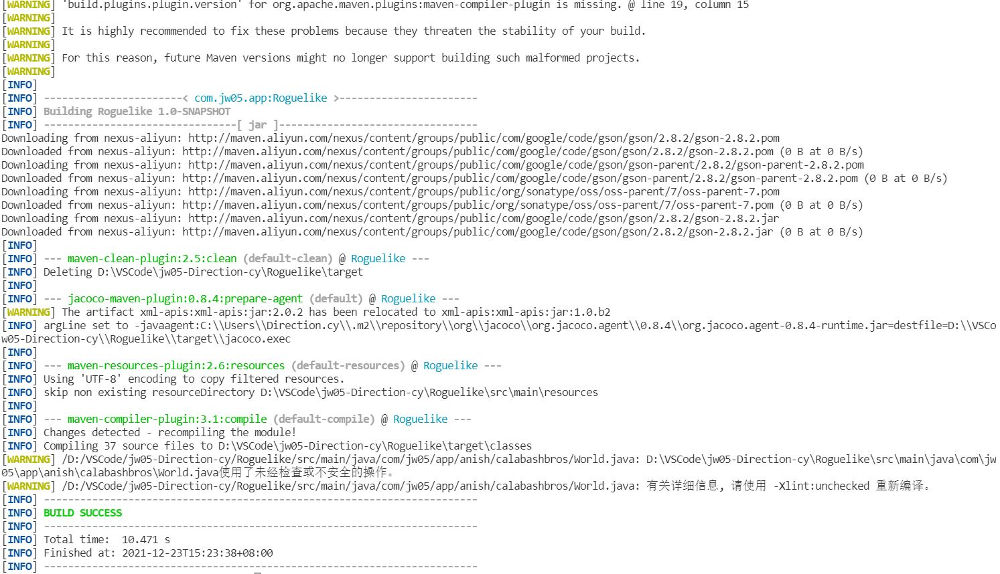
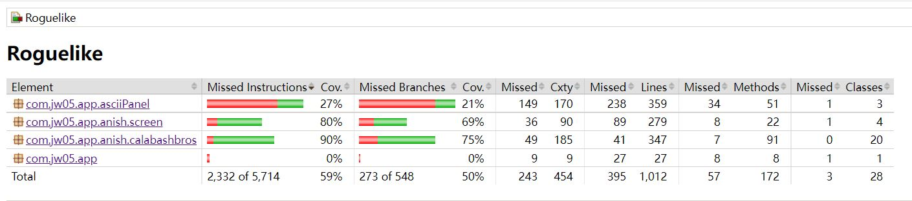

# jw05

请将jw04的迷宫任务改造为一个ruguelike的葫芦娃与妖精两方对战游戏，游戏如下图所示。

需求如下：

- 每个生物体都是一个线程
- 每个生物体的移动、攻击等行为决策可使用Minimax或其他算法（可参考https://www.baeldung.com/java-minimax-algorithm）
- 请特别注意线程race condition（两个生物体不能占据同一个tile，对同一生物体的两个攻击行为应该先后发生作用，等）
- 请发挥想象力
- 完成后录屏发qq群或小破站

## 设计了一个类似魔塔的闯关roguelike游戏

## 地图生成

采用MazeGenrator的迷宫生成随机删去一些Wall

## 怪物设计

每个怪物被一个线程控制，有CommonMonster、MagicMonster、EliteMonster三类

## 移动逻辑

怪物应在出生地一定范围内移动

    protected int bothX;
    protected int bothY;

会随机选一个方向直到不能move

    int choose = random.nextInt(4);
    while (tryWalk(choose)) {
        ...
    }

## 资源占用问题

尝试移动时，调用的world方法有synchronized关键词修饰

    public synchronized boolean tryMove(Thing t, int x, int y, int targetx, int targety)

## 攻击逻辑

如果有敌人出现在视线内

    protected int inSight(int d)

会尝试追赶，如果相邻，会尝试攻击

## 资源占用问题

尝试攻击削减血量必须依次进行

    public synchronized void decreaseHealth(int x)

## Flame类

释放火球的MagicMonster怪物会拉起一个新的线程

    Flame flame = new Flame(world, this, directions[choose][0], directions[choose][1]);
    Thread thread = new Thread(flame);
    world.put(flame, x, y);
    thread.start();

Flame可以朝一个方向冲击，造成伤害或者击毁墙壁

## 葫芦娃设计

用按键代替怪物的自动控制，框架类似

## Thing属性设计

为了编程设计给Thing设计了许多属性

    private final boolean standable;
    private final boolean available;
    private final boolean living;
    private final boolean evil;

## 物品设计

有HealthMedication、MagicMedication、ExpPacket、Key等特殊道具，按下空格可以get

# jw06

请为jw05提供游戏保存功能，可包括但不限于：
- 地图保存/地图加载；
- 进度保存/进度恢复；
- 游戏过程录制/回放。

此外：
- 请使用maven进行所有第三方库的依赖管理和项目自动化构建；
- 请为自己的代码编写junit单元测试用例，代码测试覆盖率不低于50%（vscode请使用Coverage Gutters扩展，intellij IDEA请run with coverage）。

## 保存

将world及其成员序列化

    public class World implements Serializable{
        ...
    }

通过write方法，通过this.getClass().getResource("/").getPath()得到当前类的路径，将worldscreen的world成员存入

    public void write() throws IOException, ClassNotFoundException
    {
        FileOutputStream fileOutputStream = new FileOutputStream(this.getClass().getResource("/").getPath() + "resources/gameRecords/World.txt");
        //通过ObjectOutputStream将Serializable的类序列化输出
        ObjectOutputStream objectOutputStream  = new ObjectOutputStream(fileOutputStream);
        objectOutputStream.writeObject(world);
        objectOutputStream.flush();
        objectOutputStream.close();
    }

## 加载

设计了RecordScreen类，支持加载功能

    public void read() throws IOException, ClassNotFoundException
    {
        //首先加载world
        FileInputStream fileInputStream = new FileInputStream(this.getClass().getResource("/").getPath() + "resources/gameRecords/World.txt");
        ObjectInputStream objectInputStream = new ObjectInputStream(fileInputStream);
        world = (World) objectInputStream.readObject();
        objectInputStream.close();
        exec = Executors.newFixedThreadPool(10);
        //拉起相应的Monster线程
        for (int i = 0; i < World.MAZE_WIDTH; ++i)
            for (int j = 0; j < World.MAZE_HEIGHT; ++j)
            {
                if (world.get(i, j).isCreature())
                    if (!world.get(i,j).isEvil())
                        bro = (Calabash) world.get(i,j);
                    else
                        exec.execute((Monster) world.get(i, j));
            }
    }

## 回放

主要是通过记录刷新界面的方式实现回放

    public void displayOutput(AsciiPanel terminal) {
    
        ...

        try {
            record();
        } catch (ClassNotFoundException e) {
            // TODO Auto-generated catch block
            e.printStackTrace();
        } catch (IOException e) {
            // TODO Auto-generated catch block
            e.printStackTrace();
        }

    }

record方法包括张数的记录和存储，具体不赘述

## maven构建

 

## test覆盖度

 

(PS:由于个人疏漏，jw06阶段的代码未能单独保存，存留Roguelike-1.0-SNAPSHOT.jar以供测试) 

# jw07

请将jw05改造为支持网络对战的版本，具体要求如下：
- 要求支持多方（大于两方）对战；
- 要求使用NIO Selector实现；
- 要求通信过程全局状态一致（所有玩家看到的游戏过程完全一样），可通过各方分别录制游戏过程后进行比对验证。

## 基础设计

设计了Server、Client、ServerApp、ClientApp类
Server拉起一个ServerApp，Client拉起一个ClientApp

## Server

private Map<String, SocketChannel> clientsMap，一个map绑定各个client

nio进行数据交换，主要是将screen -> json -> byte，完成传递
这里用了gson的依赖

    private void startServer() throws IOException {
		
        ...//初始化

		new Thread() {
			@Override
			public void run() {
                //每200ms传递一次消息
				while (true) {
					if (!clientsMap.isEmpty()) {
						for (Map.Entry<String, SocketChannel> entry : clientsMap.entrySet()) {
							
                            ...
                            //将worldscreen转成json通过nio进行传递
							Gson gson = new GsonBuilder().excludeFieldsWithoutExposeAnnotation().create();
							if (startType == KeyEvent.VK_1){
								if (app.getResult() == "win")
								{
									sBuffer.put("win".getBytes());
								}else if (app.getResult() == "loss")
								{
									sBuffer.put("loss".getBytes());
								}else{
									sBuffer.put(gson.toJson((WorldScreen) app.getScreen(temp)).getBytes());
								}
							}
							sBuffer.flip();
							try {
								temp.write(sBuffer);
							} catch (IOException e) {
								// TODO Auto-generated catch block
								e.printStackTrace();
							}
							sBuffer.clear();
						}
					}
					...//sleep(200)
				}
			}
		}.start();

        //对selector进行反应
		while (true) {
			try {
				selector.select();
				Set<SelectionKey> selectionKeys = selector.selectedKeys();
				for (SelectionKey key : selectionKeys) {
					handle(key);
				}
				selectionKeys.clear();
			} catch (Exception e) {
				e.printStackTrace();
				break;
			}
		}
	}

对channel进行处理

	private void handle(SelectionKey selectionKey) throws IOException {

		...//初始化

		if (selectionKey.isAcceptable()) {
	
			...//发现连接进行绑定
            ...//注册read
			
		} else if (selectionKey.isReadable()) {
	
			...//初始化

			if (count > 0) {
				
                ...//获取client传来的消息

                //app获得所有client连接
				app.setMap(clientsMap);
                //对不同的人物反应
				app.response(input, client);
				
                ...

                //向其余所有通道传递app对于此次的反应
				if(!clientsMap.isEmpty()){
					for(Map.Entry<String, SocketChannel> entry : clientsMap.entrySet()){
						
                        ...//初始化

						Gson gson = new GsonBuilder().excludeFieldsWithoutExposeAnnotation().create();
						if (startType == KeyEvent.VK_1){
							if (app.getResult().equals("win"))
								{
									sBuffer.put("win".getBytes());
								}else if (app.getResult().equals("loss"))
								{
									sBuffer.put("loss".getBytes());
								}else{
									sBuffer.put(gson.toJson((WorldScreen) app.getScreen(temp)).getBytes());
								}
						}

						...//write
					
                    }
				}
	
				...//注册read
			}  
		}
	}

## ServerApp

对client发来的消息作出反应

    public void response(int keycode, SocketChannel socketChannel)
    {
        screen.setMap(clientsMap);
        //界面的反应
        screen = screen.response(keycode, socketChannel);
        if (screen.getClass() == VictoryScreen.class)
        {
            result = "win";
        }
        if (screen.getClass() == DefeatScreen.class)
        {
            result = "loss";
        }
        repaint();
    }

## Client

startClient()先完成一些初始化，然后根据selector进行处理

    private void startClient() throws IOException {

		...
        
		while (true) {
			try {
				selector.select();
				Set<SelectionKey> selectionKeys = selector.selectedKeys();
				for (SelectionKey key : selectionKeys) {
					handle(key);
				}
				selectionKeys.clear();
			} catch (Exception e) {
				e.printStackTrace();
				break;
			}
		}
	}

对channel进行相应处理

    private void handle(SelectionKey selectionKey) throws IOException, ParseException{
 
	    if (selectionKey.isConnectable()) { 

	        ...//进行连接
	        ...//拉起app
            ...//注册read
	        
	    } else if (selectionKey.isReadable()) {
			
            ...//读取rbuffer

	        if(count>0){
	            
                ...
                
                //将获取Gson还原成worldscreen
                {
					Gson gson = new GsonBuilder().excludeFieldsWithoutExposeAnnotation().create();
					app.setScreen(gson.fromJson(receiveText, WorldScreen.class));
				}
                //重画界面
				app.repaint();

            ...//注册read

            }

	    }
	}

## ClientApp

将按键信息传给服务器

    @Override
    public void keyPressed(KeyEvent e) {
        ByteBuffer sBuffer = ByteBuffer.allocate(1024);
        sBuffer.clear();
        sBuffer.put(String.valueOf(e.getKeyCode()).getBytes());
        sBuffer.flip();
        try {
            client.write(sBuffer);
        } catch (IOException e1) {
            // TODO Auto-generated catch block
            e1.printStackTrace();
        }
        sBuffer.clear();
    }

## WorldScreen

@Expose注解用于解决gson的循环转化问题，另外绑定了channel和对应的对象
    
    @Expose
    private World world;
    
    ...

    private Map<SocketChannel, Message> messagesMap;//绑定的信息
    private Map<SocketChannel, Calabash> brosMap;//操作的绑定

    @Expose
    private Message mes = null;//对应用户状态的输出

让每个client都能对应serverapp的人物
    
    public WorldScreen(Map<String, SocketChannel> clientsMap) {
        
        ...

        //对所有连接用户的初始化
        if(!clientsMap.isEmpty()){
            for(Map.Entry<String, SocketChannel> entry : clientsMap.entrySet()){
                Calabash bro = new Calabash(Color.white, world);
                Message message = new Message();
                brosMap.put(entry.getValue(), bro);
                messagesMap.put(entry.getValue(), message);
                setMessage(entry.getValue());
                world.put(bro, i++, 0);
            }
        }
       
        ...

    }

对每个client都有自己的信息

    @Override
    public void displayOutput(AsciiPanel terminal) {
        
        ...
        
        //存储相应状态
        if(messagesMap != null && !messagesMap.isEmpty()){
            for(Map.Entry<SocketChannel,Message> entry : messagesMap.entrySet()){
                setMessage(entry.getKey());
            }
        }

        if (mes != null)
        {
            ...//根据mes输出状态
        }
        

        
    }

对client发来的键码作出反应

    @Override
    public Screen response(int keycode, SocketChannel socketChannel) {
        Calabash bro = brosMap.get(socketChannel);
        
        ...//胜利失败判定

        ...//相应操作

        //设置mes
        setMessage(socketChannel);
        return this;
    }

状态设置

    @Override
    public void setChannelMessage(SocketChannel socketChannel) {
        //应该输出的状态
        mes =messagesMap.get(socketChannel);
    }
}
