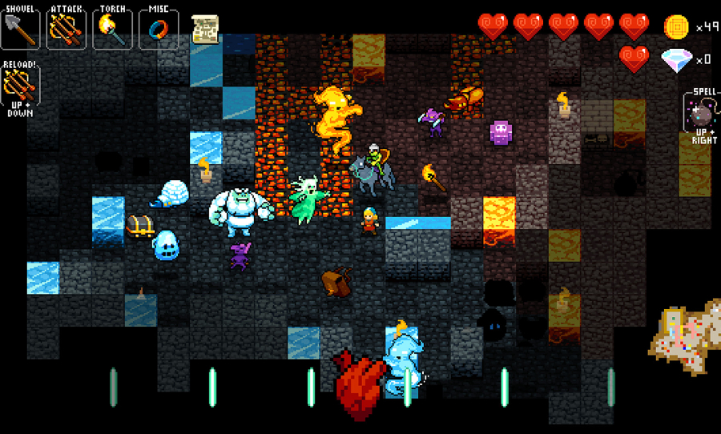

# jw05

请将jw04的迷宫任务改造为一个ruguelike的葫芦娃与妖精两方对战游戏，游戏如下图所示。

需求如下：

- 每个生物体都是一个线程
- 每个生物体的移动、攻击等行为决策可使用Minimax或其他算法（可参考https://www.baeldung.com/java-minimax-algorithm）
- 请特别注意线程race condition（两个生物体不能占据同一个tile，对同一生物体的两个攻击行为应该先后发生作用，等）
- 请发挥想象力
- 完成后录屏发qq群或小破站

## 设计了一个类似魔塔的闯关roguelike游戏

## 地图生成

采用MazeGenrator的迷宫生成随机删去一些Wall

## 怪物设计

每个怪物被一个线程控制，有CommonMonster、MagicMonster、EliteMonster三类

## 移动逻辑

怪物应在出生地一定范围内移动

    protected int bothX;
    protected int bothY;

会随机选一个方向直到不能move

    int choose = random.nextInt(4);
    while (tryWalk(choose)) {
        ...
    }

## 资源占用问题

尝试移动时，调用的world方法有synchronized关键词修饰

    public synchronized boolean tryMove(Thing t, int x, int y, int targetx, int targety)

## 攻击逻辑

如果有敌人出现在视线内

    protected int inSight(int d)

会尝试追赶，如果相邻，会尝试攻击

## 资源占用问题

尝试攻击削减血量必须依次进行

    public synchronized void decreaseHealth(int x)

## Flame类

释放火球的MagicMonster怪物会拉起一个新的线程

    Flame flame = new Flame(world, this, directions[choose][0], directions[choose][1]);
    Thread thread = new Thread(flame);
    world.put(flame, x, y);
    thread.start();

Flame可以朝一个方向冲击，造成伤害或者击毁墙壁

## 葫芦娃设计

用按键代替怪物的自动控制，框架类似

## Thing属性设计

为了编程设计给Thing设计了许多属性

    private final boolean standable;
    private final boolean available;
    private final boolean living;
    private final boolean evil;

## 物品设计

有HealthMedication、MagicMedication、ExpPacket、Key等特殊道具，按下空格可以get

# jw06

请为jw05提供游戏保存功能，可包括但不限于：
- 地图保存/地图加载；
- 进度保存/进度恢复；
- 游戏过程录制/回放。

此外：
- 请使用maven进行所有第三方库的依赖管理和项目自动化构建；
- 请为自己的代码编写junit单元测试用例，代码测试覆盖率不低于50%（vscode请使用Coverage Gutters扩展，intellij IDEA请run with coverage）。

# jw07

请将jw05改造为支持网络对战的版本，具体要求如下：
- 要求支持多方（大于两方）对战；
- 要求使用NIO Selector实现；
- 要求通信过程全局状态一致（所有玩家看到的游戏过程完全一样），可通过各方分别录制游戏过程后进行比对验证。

